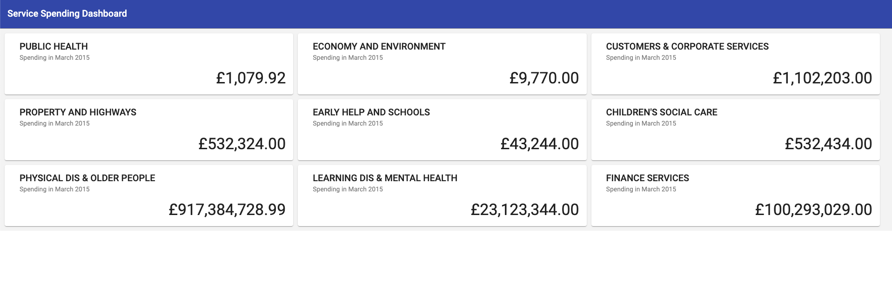

### Panaseer Engineering: Frontend Take Home Coding Exercise 🖥️

👋 Welcome to our Frontend take-home coding project! This is a chance for you to show us how you think through solutions, approach technical designs and adapt to an existing codebase. Remember you really **shouldn't spend more than 4 hours** on this exercise, otherwise you risk over-cooking it.

⏰ If you run out of time to complete all the tasks, don't worry! Rather than coding until the last minute set yourself an end time and use 30 minutes at the end to reflect how you can tell us about your experience and how you approached the work. If you didn't get through all the scenarios perhaps think about how you would've approached the next one and tell us about it. If you did get through all of them then tell us what you would do next with more time.

🚀 With that out of the way, let's get started...

---

### The Application
For the coding exercise we are building on an application that has an existing frontend and api. Your tasks will focus on finishing and extending specific aspects of the project to satisfy the user's needs.

### The Data

The dataset used by the application holds spending/expenses data for a single UK council.
The spending in this data set is categorised by `service`, which are departments within the council eg. `PUBLIC HEALTH`.

This data is loaded into the `Spending` table with the model representation in the `Spending` class.

This raw data is then aggregated to give the total spending per service.

### Our User
Our main user is the Council Accountant for Rochdale Borough. One of their responsibilities is monitoring the total spending of the different services. To support our user in that task, we've started creating a dashboarding application that shows the total spending by each service.

---
## Application Structure
### The Frontend
There are 2 different directories for the FE, one is written in React and the other in Angular, please use one and ignore the other. So far the implementation includes the dashboard UI components to visualise spending for each council service.

Instructions on running the frontend are available in the Readme file in either of the FE directories. After starting up the FE, you should see a dashboard similar to the one in the screenshot below. This is what we will be building on in this exercise.

### The API
The API is based on Java, Gradle, Spring Boot and Spring MVC. The current implementation loads the spending data from a sql script into an in-memory H2 database on application startup. The tasks should not require modifications to this data loading. The spending data can be accessed using the `SpendingRepository`.

Instructions on running the api are available in the [Readme](./api/README.md) file of the [api](./api) directory.

## DTOs

The DTOs that are used for communication between the API and FE.

### View
* `id` --> `(number)` `(Auto generated)` The identifier for the view. Should be null or unset for creation
* `name` --> `(text)` The name of the view
* `services` --> `(Array of text)` The list of services included in the view

### ServiceSpending
* `service` --> (text) The name of the service
* `spending` --> (number) The total spending of the service

## Endpoints

The APIs that are used for communication between the API and FE.

### Services
* Get total spend for each service -> `GET http://localhost:8080/spending/services` returns `Array of ServiceSpending`
* Get total spend for each service in view ->  `GET http://localhost:8080/spending/services/view/{id}` returns `Array of ServiceSpending`

### Views
* Get all views --> `GET http://localhost:8080/views` returns `Array of View`
* Create view --> `POST http://localhost:8080/views` returns `View` with auto generated id
* Read view --> `GET http://localhost:8080/views/{id}` returns `View`
* Update view --> `PUT http://localhost:8080/views/{id}` returns `View`
* Delete view --> `Delete http://localhost:8080/views/{id}`

---

## The Exercise

Your challenge is to implement the following user stories on top of the existing Council Spending Dashboard API and FE provided to you.
Given you should only spend 4 hours on the solution don't worry if this is not enough time to implement all user stories, it's more important we understand how you approached the exercise.

### User Stories
* As a Council Accountant, I need to be able to create a view that just shows the services I am responsible for, so that I can quickly see budget issues I need to act on.
* As a Council Accountant, I need to be able to name of the views I create, so that I can find my particular view
* As a Council Accountant, I need to be able to add new services to my view after creating it, so if my remit change I can update it
* As a Council Accountant, I should be able to select which services I want to appear at the top of my view, so I can prioritise my work

### Notes
- This will only require modification to the FE(in either Angular or React).
- You should use ngrx/redux to manage the state to ensure your solution can scale
- You do not have to implement any form of user system

---

### Technical Design
*The application is likely to grow beyond these user stories in future. As you approach technical changes for the tasks please consider maintainability, scalability and reusability of the code.*

### Testing
*Testing is not the primary focus of this exercise. If you have time to showcase a unit test on the FE that would be great, but not strictly required. The project has a test runner set up with more information in the respective Readme files.*
